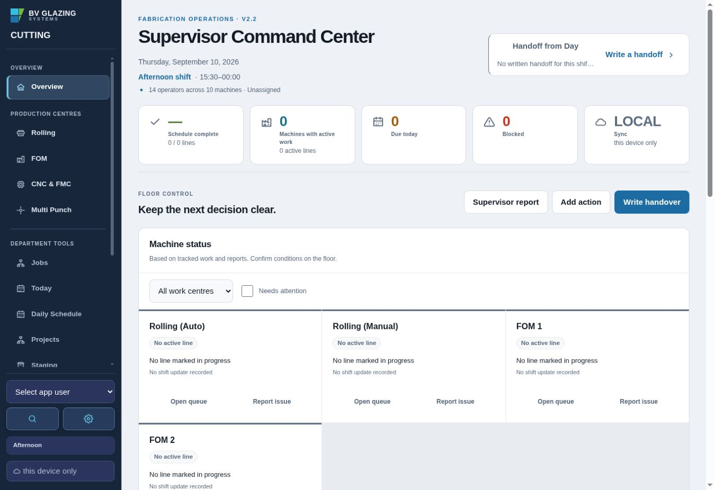
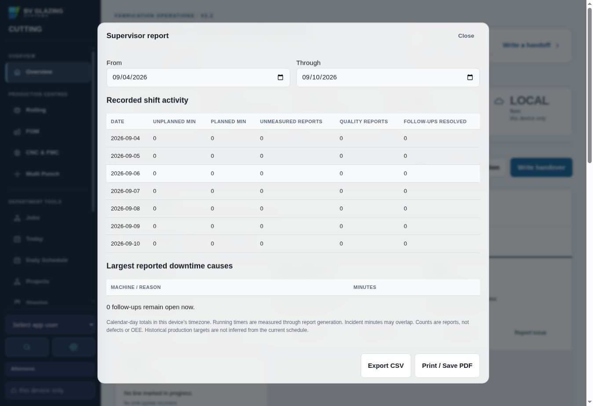
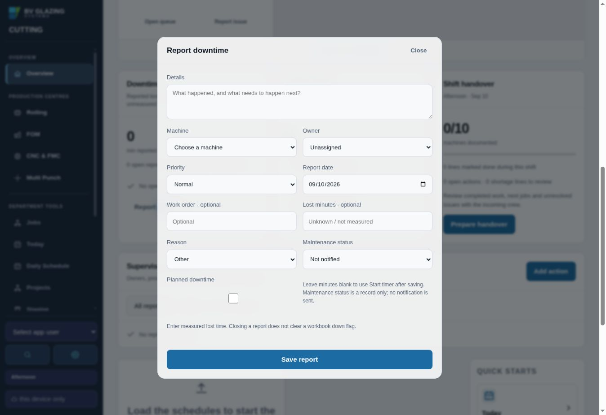

# Logic and supervisor guidance review

Scope: the live V2.2 dashboard, Supervisor report and downtime entry on September 10, 2026. The browser had no imported production data; no real production records were created or changed. Calculation findings were checked separately against the source and synthetic records.

## 1. Dashboard — functional, interpretation needs care

Navigation and named controls are clear. The empty schedule showed a zero-percent accessibility progress label, while configured operator counts appeared to describe actual attendance. There was no consolidated next-step guidance for operational reports.

Changes: no empty-schedule progress bar; configured staffing is labelled as unconfirmed attendance, including outside shift hours. Schedule completion identifies all loaded dates. Suggested next steps explain the supporting records and open the existing editor, Setup or handover. Running losses, recovery verification, undocumented quality containment, overdue actions and missing owners are checked in that order. Only the first four checks are shown; all reports remain available below. High-priority actions remain first, with overdue actions ordered by due date next.

## 2. Supervisor report — functional, calculation corrections needed

The date controls and CSV/PDF actions are discoverable, but an empty period displayed only zeros under “Recorded shift activity.” These are calendar-day figures. Code inspection also found completion dates sliced in UTC, impossible dates accepted through JavaScript date rollover, and custom machine names ignored.

Changes: local completion dates, strict real-date validation, no future range, configured machine labels, explicit empty-period guidance, and “Recorded daily activity” wording. CSV carries the same interpretation note as the screen/PDF. Open reports are explicitly all dates; resolved counts include all report types. No historical OEE, attendance or production targets are inferred.

## 3. Downtime entry — functional, lifecycle explanation needed

Inputs have visible labels and useful unknown-time placeholders. The initial copy did not clearly explain that a timer starts when pressed rather than from the report date. Code inspection found a stopped timer still classified as reported down and live handover minutes taken from the last saved total.

Changes: timer instructions distinguish past measured losses from ongoing losses. Stopped timers and repaired reports require status verification, without asserting that the machine is running. Imported down warnings remain visible. Handover text uses current elapsed time and labels running timers. Existing report types cannot be converted, preserving timer/quality metadata meaning.

## Evidence and verification limits

Screenshots establish visible wording and layout, not calculation accuracy or full accessibility compliance. No live customer data or true machine telemetry was available. Local preview access was blocked by the browser and the local Playwright executable was missing, so the changed interface is checked by the repository's GitHub Actions browser suite. Existing tests are unchanged. New domain checks cover UTC/Toronto completion dates, invalid/future ranges, timer lifecycle, imported warnings, custom labels, safe report types, current handover minutes and suggestion ordering. A new mobile browser check covers suggestion navigation, empty states, stopped timers and horizontal reflow.

## Suggested next improvements

1. Define target units by machine before adding attainment or OEE: Multi Punch windows must not be mixed with cut pieces. Confirm how bandsaw/setup time belongs in Elumatec targets.
2. Separate confirmed machine recovery from report closure with an explicit recovery time and verifier, once the desired shop-floor process is agreed.
3. Add an explicit “shift checked, no losses recorded” submission before treating missing downtime as a confirmed zero.
4. Capture a stable historical shift target snapshot before introducing trend comparisons against plan.

These larger changes require agreed production definitions. This pass preserves the current record format and avoids guessing those definitions.
